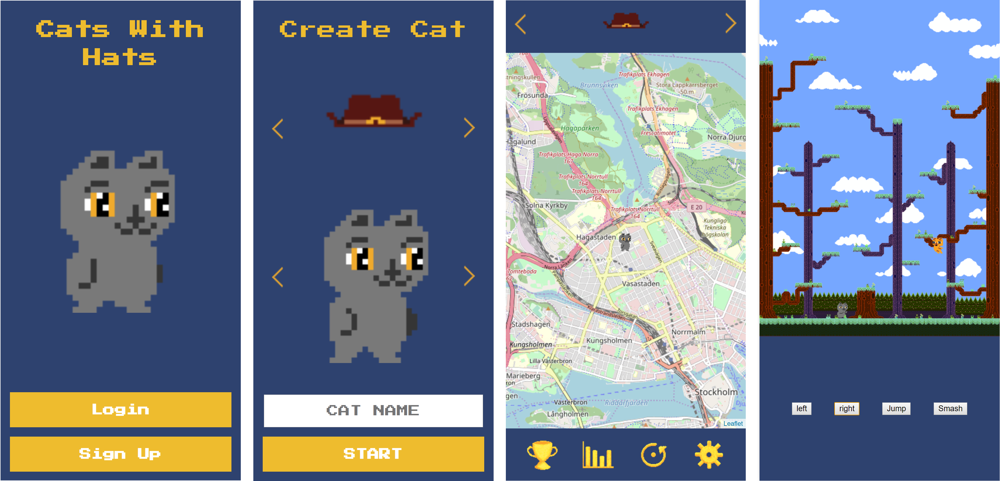

# Cats with Hat (vision)

A cat with a hat is a game where you collect hats, and the player with most hats wins. You can either search for hats on a map in real places around the world or you can challenge people who are nearby on the street.

You can also challenge the computer to win hats. It's like poker. You bet the hat that your cat is wearing, and if you lose the challenge, the opponent gets your hat. There are different hats, and some of them have one or more special power that can be used in the battle mode.

You start by choosing a cat with a color that you prefer

Then match your cat with a nice hat.

## How far we have come:
For now we just implemented so that the player can play against a computer AI. The goal is to implement a multiplayer version of the battle so that players can battle eachother for hats. 

### Features to implement
A brief overview of the features that needs implementation before the game can go to beta.

*Player view:*
* Multiplayer ( preferable via firebase )
* Stats page with real data from the player
* Save data from gamepage to database
* Implement leaderboard feature with lists for most hats and most wins
* Expand settings to include more options and make sounds link toggle sound on/off

*Admin page:*
* Create component for player list (see XD design)
* Render all users in the "players" component
* Add function to add hats to the game on the assets page
* Get data and display on the dashboard (e.g online users etc)

*Unity build:*
* Get the game to display the cat color from the user (database)
* Add player indicator above the cat like P1 / P2 (maybe the player displayname)
* Add a pause when a round has ended
* Add win/lose screen

## Requirements
To contribute to this project you will need to be somewhat confortable with react.js, firebase and have used npm libraires a couple of times.

### Unity
It's not a requirement but we should point out that the battle page is rendered with Unity and brought in by react-unity-webgl and output a score. So knowing your way around unity in somewhat helpful.

## Dependencies
In this project we were required to use Firebase and Styled-Components. As stated above we used unity (see unity repo https://github.com/danielrydh/cat-game-unity) to build our battle mode. 

These are the dependencies we used. 
* styled-components (https://github.com/styled-components/styled-components/)
* firebase (https://firebase.com/)
* leaflet (https://leafletjs.com/)
* react (https://reactjs.org/)
* react-dom (https://www.npmjs.com/package/react-dom)
* react-router-dom (https://www.npmjs.com/package/react-router-dom)
* react-scripts (https://www.npmjs.com/package/react-scripts)
* react-swipe (https://www.npmjs.com/package/react-swipe)
* react-unity-webgl (https://www.npmjs.com/package/react-unity-webgl)
* reactjs-popup (https://www.npmjs.com/package/reactjs-popup)
* react-geolocated (https://www.npmjs.com/package/react-geolocated)
* recompose (https://www.npmjs.com/package/recompose)

### Fonts
Google Fonts Press Start 2P (https://fonts.google.com/specimen/Press+Start+2P)

### Original contributors

Fabian Forsström
https://github.com/fabifors

Sara Överström
https://github.com/oversteem

Moitrayee Choudhury
https://github.com/moitrayee3009

Dessi Costa
https://github.com/DessiC

Daniel Rydh
https://github.com/danielrydh

## Other repos
We choose to split everything in to three different project repos. Here are the links to the other dependencies. 

Unity repo
https://github.com/danielrydh/cat-game-unity

Admin page repo
https://github.com/fabifors/team-icecream-admin

# create-react-app

This project was created using create-react-app. (https://github.com/facebook/create-react-app). The following commands are the standard scripts that are used to run, build and install dependecies.

## Available Scripts

In the project directory, you can run:

### `npm install`

Allways run this command to install all dependencies first.

### `npm start`

Runs the app in the development mode. 
Open [http://localhost:3000](http://localhost:3000) to view it in the browser.

The page will reload if you make edits. 
You will also see any lint errors in the console.

### `npm run build`

Builds the app for production to the `build` folder. 
It correctly bundles React in production mode and optimizes the build for the best performance.

The build is minified and the filenames include the hashes. 
Your app is ready to be deployed!

See the section about [deployment](https://facebook.github.io/create-react-app/docs/deployment) for more information.
